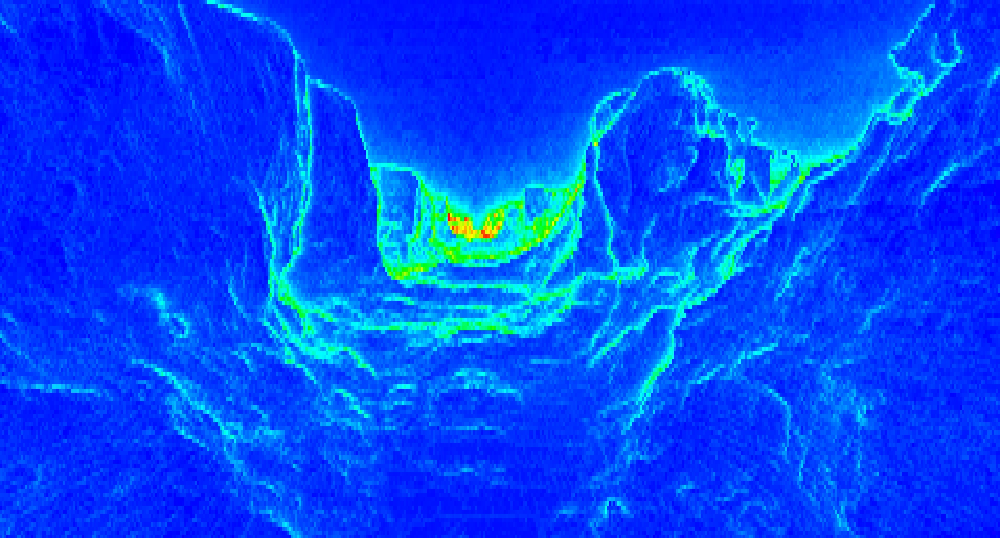

[](https://travis-ci.com/azhirnov/glsl_trace)
[](https://github.com/azhirnov/glsl_trace/blob/master/LICENSE)

# GLSL Trace

## Features
 * shader debugging
 * shader profiling (using extensions [EXT_shader_realtime_clock](https://github.com/KhronosGroup/GLSL/blob/master/extensions/ext/EXT_shader_realtime_clock.txt) and [ARB_shader_clock](https://www.khronos.org/registry/OpenGL/extensions/ARB/ARB_shader_clock.txt))
 * supports mesh and ray tracing shaders (Vulkan only)


## Dependencies
 * [glslang](https://github.com/KhronosGroup/glslang) - required
 * [SPIRV-Cross](https://github.com/KhronosGroup/SPIRV-Cross) - required for OpenGL
 * [GLFW](https://www.glfw.org/) - for tests
 * [GLEW](http://glew.sourceforge.net/) - for tests


## How to use
**Setup:**</br> 
 * (__OpenGL__) Create shader and shader program for reqular rendering.
 * Use [glslang](https://github.com/KhronosGroup/glslang) to parse GLSL or HLSL source code and build AST
 * (__Vulkan__) Convert glslang AST to SPIRV and create pipeline for reqular rendering.
 * Create `ShaderTrace` object to store debug information
 * Get glslang AST `TProgram::getIntermediate(EShLanguage stage)`
 * Insert trace recording `ShaderTrace::InsertTraceRecording(TIntermediate &intermediate, uint32_t setIndex)` or `ShaderTrace::InsertFunctionProfiler(TIntermediate &intermediate, uint32_t setIndex, bool shaderSubgroupClock, bool shaderDeviceClock)`, where:</br>
   shaderSubgroupClock - requires OpenGL extension [GL_ARB_shader_clock](https://www.khronos.org/registry/OpenGL/extensions/ARB/ARB_shader_clock.txt), requires Vulkan extension `VK_KHR_shader_clock` and `VkPhysicalDeviceShaderClockFeaturesKHR::shaderSubgroupClock` must be true.</br>
   shaderDeviceClock - requires OpenGL extension [GL_EXT_shader_realtime_clock](https://github.com/KhronosGroup/GLSL/blob/master/extensions/ext/GL_EXT_shader_realtime_clock.txt), requires Vulkan extension `VK_KHR_shader_clock` and `VkPhysicalDeviceShaderClockFeaturesKHR::shaderDeviceClock` must be true.</br>
   `descSetIndex` - descriptor set index that will be reserved for storage buffer (Vulkan only)</br>
 * (__Vulkan__) Convert AST with trace recording to SPIRV and create pipeline for debugging.
 * (__OpenGL__) Convert AST to SPIRV, use [SPIRV-Cross](https://github.com/KhronosGroup/SPIRV-Cross) to get GLSL code and create shader program for debugging.


**To debug draw or compute or ray tracing invocation:**</br> 
 
 * (__Vulkan__) bind pipeline that contains shader with inserted trace recording
 * (__Vulkan__) bind descriptor set with storage buffer to index `descSetIndex`
 * (__OpenGL__) bind shader program that contains shader with inserted trace recording
 * (__OpenGL__) get shader storage block index of `dbg_ShaderTraceStorage`and bind storage buffer to that index.
 * after invocation map storage buffer and pass pointer to `ShaderTrace::ParseShaderTrace (const void *ptr, uint64_t maxSize, vector<string> &result)`
 
 
## How its works
 **Debugging:**
 * AST processing: log all function results, log all function calls, log some operator results.
 * Result parsing: write modified values, write unmodified values that are used, write line number and line from source code.
 
 **Pixel/invocation profiling:**
 * AST processing: insert time measurement into user-defined functions.
 * Result parsing: calculate average time and a fraction of the total shader execution time.
 
 **Frame profiling:**
 * AST processing: insert time measurement into entry function.
 * Result: sum of shader invocation time per pixel or tile.
 
 **All:**
 * Shader trace recorded to the storage buffer as forward list using atomic operations.
 * Each `ShaderTrace` object has unique number to determine different shaders when parsing results.
 * Allowed debugging on different shader stages in single draw/dispatch call.
 * Many invocations of same or different shaders can be recoreded into one storage buffer.


## Debugging

<details>
<summary>Enable pixel/invocation debugging from code (OpenGL)</summary>
   
```cpp
// use glslang to compile shader from source
// for full source code see 'CreateShader()' in 'tests/OpenGL/ShaderCompiler.cpp'
glslang::TProgram  program;
...

// after program compilation get AST
TIntermediate*  intermediate = program.getIntermediate( ... );

// insert trace recording into glslang AST
ShaderTrace  shaderTrace;
shaderTrace.InsertTraceRecording( *intermediate, /*unused*/0 );

// Parts of shader source code will be inserted into shader trace results
shaderTrace.SetSource( ... );

// add included source files if used '#include' directive
shaderTrace.IncludeSource( ... );

// convert AST to SPIRV binary
glslang::GlslangToSpv( *intermediate, spirvData, ... );

// use SPIRV-Cross to convert SPIRV binary into GLSL code
spirv_cross::CompilerGLSL  compiler {spirvData.data(), spirvData.size()};
string  shaderSrc = compiler.compile();

// create shaders and program
...

// create buffer for shader output
uint32_t bufferSize = 4u << 20;
glGenBuffers( 1, &dbgBuffer );
glBindBuffer( GL_SHADER_STORAGE_BUFFER, dbgBuffer );
glBufferStorage( GL_SHADER_STORAGE_BUFFER, bufferSize, nullptr, GL_MAP_READ_BIT | GL_DYNAMIC_STORAGE_BIT );

// bind buffer to shader
GLuint	sb_index = glGetProgramResourceIndex( program, GL_SHADER_STORAGE_BLOCK, "dbg_ShaderTraceStorage" );
glShaderStorageBlockBinding( program, sb_index, /*binding*/0 );
glBindBufferBase( GL_SHADER_STORAGE_BUFFER, /*binding*/0, dbgBuffer );
		
// clear buffer
uint32_t  zero = 0;
glClearBufferData( GL_SHADER_STORAGE_BUFFER, GL_R32UI, GL_RED_INTEGER, GL_UNSIGNED_INT, &zero );

// set pixel which you need to debug (2 components)
// record if {pixel_x, pixel_y} == floor(gl_FragCoord.xy)
uint32_t  data[] = { pixel_x, pixel_y };
glBufferSubData( GL_SHADER_STORAGE_BUFFER, 0, sizeof(data), data );

// draw
...

// ... or which compute invocation or ray tracing launch (3 components)
// record if {thread_x, thread_y, thread_z} == gl_GlobalInvocationID
// record if {thread_x, thread_y, thread_z} == gl_LaunchID
uint32_t  data[] = { thread_x, thread_y, thread_z };
glBufferSubData( GL_SHADER_STORAGE_BUFFER, 0, sizeof(data), data );

// dispatch or trace
...

// read buffer data
void* ptr = glMapBuffer( GL_SHADER_STORAGE_BUFFER, GL_READ_ONLY );

// get shader trace as a string
vector<string>  result;
shaderTrace.ParseShaderTrace( ptr, bufferSize, result );
```
</details>
<details>
<summary>Enable pixel/invocation debugging from code (Vulkan)</summary>
   
```cpp
// use glslang to compile shader from source
// for full source code see 'Device::_Compile()' in 'tests/Vulkan/Device.cpp' 
glslang::TProgram  program;
...

// after program compilation get AST
TIntermediate*  intermediate = program.getIntermediate( ... );

// insert trace recording into glslang AST
// descSetIndex - any free descriptor set index
ShaderTrace  shaderTrace;
shaderTrace.InsertTraceRecording( *intermediate, descSetIndex );

// Parts of shader source code will be inserted into shader trace results
shaderTrace.SetSource( ... );

// add included source files if used '#include' directive
shaderTrace.IncludeSource( ... );

// convert AST to SPIRV binary
glslang::GlslangToSpv( *intermediate, spirvData, ... );
	
// create pipeline
...

// create buffer for shader output
VkBufferCreateInfo	info = {};
info.sType  = VK_STRUCTURE_TYPE_BUFFER_CREATE_INFO;
info.size   = 4u << 20;
info.usage  = VK_BUFFER_USAGE_TRANSFER_SRC_BIT | VK_BUFFER_USAGE_TRANSFER_DST_BIT | VK_BUFFER_USAGE_STORAGE_BUFFER_BIT;
vkCreateBuffer( device, &info, nullptr, &debugOutputBuffer );

info.usage  = VK_BUFFER_USAGE_TRANSFER_DST_BIT;
vkCreateBuffer( device, &info, nullptr, &stagingBuffer );

// bind descriptor set with 'debugOutputBuffer'
vkCmdBindDescriptorSets( cmdBuffer, VK_PIPELINE_BIND_POINT_GRAPHICS, ppln_layout, descSetIndex, 1, &dbg_desc_set, 0, nullptr );
	
// set pixel which you need to debug (2 components)
// record if {pixel_x, pixel_y} == floor(gl_FragCoord.xy)
uint32_t  data[] = { pixel_x, pixel_y };
vkCmdUpdateBuffer( cmdBuffer, debugOutputBuffer, 0, sizeof(data), data );
vkCmdFillBuffer( cmdBuffer, debugOutputBuffer, sizeof(data), VK_WHOLE_SIZE, 0 );

// draw
...

// ... or which compute invocation or ray tracing launch (3 components)
// record if {thread_x, thread_y, thread_z} == gl_GlobalInvocationID
// record if {thread_x, thread_y, thread_z} == gl_LaunchID
uint32_t  data[] = { thread_x, thread_y, thread_z };
vkCmdUpdateBuffer( cmdBuffer, debugOutputBuffer, 0, sizeof(data), data );
vkCmdFillBuffer( cmdBuffer, debugOutputBuffer, sizeof(data), VK_WHOLE_SIZE, 0 );

// dispatch or trace
...

// copy buffer data to staging buffer and map
...
void* ptr;
vkMapMemory( device, stagingBuffer, 0, info.size, 0, &ptr );

// get shader trace as a string
vector<string>  result;
shaderTrace.ParseShaderTrace( ptr, info.size, result );
```
</details>

<details>
<summary>Enable debugging from shader source</summary>

```cpp
// empty function will be replaced during shader compilation
void dbg_EnableTraceRecording (bool b) {}

void main ()
{
    bool condition = ...
        
    // if 'condition' is true then trace recording will start here
    dbg_EnableTraceRecording( condition );
    ...
}
```

Pause trace recording
```cpp
// empty functions will be replaced during shader compilation
void dbg_EnableTraceRecording (bool b) {}
void dbg_PauseTraceRecording (bool b) {}

void main ()
{
    bool condition = ...
    
    // if 'condition' is true then trace recording will start here
    dbg_EnableTraceRecording( condition );
    ...
	
	// pause
	dbg_PauseTraceRecording( true );
	
	// trace will not be recorded
	...
	
	// resume
	dbg_PauseTraceRecording( false );
	...
}
```
</details>

<details>
<summary>Example of shader trace</summary>

```cpp
//> gl_GlobalInvocationID: uint3 {8, 8, 0}
//> gl_LocalInvocationID: uint3 {0, 0, 0}
//> gl_WorkGroupID: uint3 {1, 1, 0}
no source

//> index: uint {136}
//  gl_GlobalInvocationID: uint3 {8, 8, 0}
11. index = gl_GlobalInvocationID.x + gl_GlobalInvocationID.y * gl_NumWorkGroups.x * gl_WorkGroupSize.x;

//> size: uint {256}
12. size = gl_NumWorkGroups.x * gl_NumWorkGroups.y * gl_WorkGroupSize.x * gl_WorkGroupSize.y;

//> value: float {0.506611}
//  index: uint {136}
//  size: uint {256}
13. value = sin( float(index) / size );

//> imageStore(): void
//  gl_GlobalInvocationID: uint3 {8, 8, 0}
//  value: float {0.506611}
14.     imageStore( un_OutImage, ivec2(gl_GlobalInvocationID.xy), vec4(value) );
```
The `//>` symbol marks the modified variable or function result.
</details>


## Pixel profiling

<details>
<summary>Enable pixel/invocation profiling from code (OpenGL)</summary>
   
```cpp
// use glslang to compile shader from source
// for full source code see 'CreateShader()' in 'tests/OpenGL/ShaderCompiler.cpp'
glslang::TProgram  program;
...

// after program compilation get AST
TIntermediate*  intermediate = program.getIntermediate( ... );

// insert profiling code into glslang AST
ShaderTrace  shaderTrace;
shaderTrace.InsertFunctionProfiler( *intermediate, /*unused*/0, true, true ); // TODO: check extensions

// convert AST to SPIRV binary
glslang::GlslangToSpv( *intermediate, spirvData, ... );

// use SPIRV-Cross to convert SPIRV binary into GLSL code
spirv_cross::CompilerGLSL  compiler {spirvData.data(), spirvData.size()};
string  shaderSrc = compiler.compile();

// create shaders and program
...

// create buffer for shader output
uint32_t bufferSize = 4u << 20;
glGenBuffers( 1, &dbgBuffer );
glBindBuffer( GL_SHADER_STORAGE_BUFFER, dbgBuffer );
glBufferStorage( GL_SHADER_STORAGE_BUFFER, bufferSize, nullptr, GL_MAP_READ_BIT | GL_DYNAMIC_STORAGE_BIT );

// bind buffer to shader
GLuint	sb_index = glGetProgramResourceIndex( program, GL_SHADER_STORAGE_BLOCK, "dbg_ShaderTraceStorage" );
glShaderStorageBlockBinding( program, sb_index, /*binding*/0 );
glBindBufferBase( GL_SHADER_STORAGE_BUFFER, /*binding*/0, dbgBuffer );

// clear buffer
uint32_t  zero = 0;
glClearBufferData( GL_SHADER_STORAGE_BUFFER, GL_R32UI, GL_RED_INTEGER, GL_UNSIGNED_INT, &zero );

// set pixel which you need to profile (2 components)
// record if {pixel_x, pixel_y} == floor(gl_FragCoord.xy)
uint32_t  data[] = { pixel_x, pixel_y };
glBufferSubData( GL_SHADER_STORAGE_BUFFER, 0, sizeof(data), data );

// draw
...

// ... or which compute invocation or ray tracing launch (3 components)
// record if {thread_x, thread_y, thread_z} == gl_GlobalInvocationID
// record if {thread_x, thread_y, thread_z} == gl_LaunchID
uint32_t  data[] = { thread_x, thread_y, thread_z };
glBufferSubData( GL_SHADER_STORAGE_BUFFER, 0, sizeof(data), data );

// dispatch or trace
...

// read buffer data
void* ptr = glMapBuffer( GL_SHADER_STORAGE_BUFFER, GL_READ_ONLY );

// get profiling info as a string
vector<string>  result;
shaderTrace.ParseShaderTrace( ptr, bufferSize, result );
```
</details>
<details>
<summary>Enable pixel/invocation profiling from code (Vulkan)</summary>
   
```cpp
// get shader clock extension features
VkPhysicalDeviceShaderClockFeaturesKHR	shaderClockFeat;
...

// use glslang to compile shader from source
// for full source code see 'Device::_Compile()' in 'tests/Vulkan/Device.cpp'  
glslang::TProgram  program;
...

// after program compilation get AST
TIntermediate*  intermediate = program.getIntermediate( ... );
	
// insert profiling code into glslang AST
// descSetIndex - any free descriptor set index
ShaderTrace  shaderTrace;
shaderTrace.InsertFunctionProfiler( *intermediate, descSetIndex, shaderClockFeat.shaderSubgroupClock, shaderClockFeat.shaderDeviceClock );

// convert AST to SPIRV binary
glslang::GlslangToSpv( *intermediate, spirvData, ... );
	
// create pipeline
...

// create buffer for shader output
VkBufferCreateInfo	info = {};
info.sType  = VK_STRUCTURE_TYPE_BUFFER_CREATE_INFO;
info.size   = 4u << 20;
info.usage  = VK_BUFFER_USAGE_TRANSFER_SRC_BIT | VK_BUFFER_USAGE_TRANSFER_DST_BIT | VK_BUFFER_USAGE_STORAGE_BUFFER_BIT;
vkCreateBuffer( device, &info, nullptr, &debugOutputBuffer );

info.usage  = VK_BUFFER_USAGE_TRANSFER_DST_BIT;
vkCreateBuffer( device, &info, nullptr, &stagingBuffer );

// bind descriptor set with 'debugOutputBuffer'
vkCmdBindDescriptorSets( cmdBuffer, VK_PIPELINE_BIND_POINT_GRAPHICS, ppln_layout, descSetIndex, 1, &dbg_desc_set, 0, nullptr );

// set pixel which you need to debug (2 components)
// record if {pixel_x, pixel_y} == floor(gl_FragCoord.xy)
uint32_t  data[] = { pixel_x, pixel_y };
vkCmdUpdateBuffer( cmdBuffer, debugOutputBuffer, 0, sizeof(data), data );
vkCmdFillBuffer( cmdBuffer, debugOutputBuffer, sizeof(data), VK_WHOLE_SIZE, 0 );

// draw
...

// ... or which compute invocation or ray tracing launch (3 components)
// record if {thread_x, thread_y, thread_z} == gl_GlobalInvocationID
// record if {thread_x, thread_y, thread_z} == gl_LaunchID
uint32_t  data[] = { thread_x, thread_y, thread_z };
vkCmdUpdateBuffer( cmdBuffer, debugOutputBuffer, 0, sizeof(data), data );
vkCmdFillBuffer( cmdBuffer, debugOutputBuffer, sizeof(data), VK_WHOLE_SIZE, 0 );

// dispatch or trace
...

// copy buffer data to staging buffer and map
...
void* ptr;
vkMapMemory( device, stagingBuffer, 0, info.size, 0, &ptr );

// get profiling info as a string
vector<string>  result;
shaderTrace.ParseShaderTrace( ptr, info.size, result );
```
</details>

<details>
<summary>Enable profiling from shader source</summary>
   
```cpp
// empty function will be replaced during shader compilation
void dbg_EnableProfiling (bool b) {}
    
void main ()
{
    bool condition = ...
        
    // if condition is true then profiling will start here
    dbg_EnableProfiling( condition );
    ...
}
```
</details>

<details>
<summary>Example of shader profiling output</summary>

```cpp
//> gl_GlobalInvocationID: uint3 {512, 512, 0}
//> gl_LocalInvocationID: uint3 {0, 0, 0}
//> gl_WorkGroupID: uint3 {64, 64, 0}
no source

// subgroup total: 100.00%,  avr: 100.00%,  (95108.00)
// device   total: 100.00%,  avr: 100.00%,  (2452.00)
// invocations:    1
106. void main ()

// subgroup total: 89.57%,  avr: 89.57%,  (85192.00)
// device   total: 89.56%,  avr: 89.56%,  (2196.00)
// invocations:    1
29. float FBM (in float3 coord)

// subgroup total: 84.67%,  avr: 12.10%,  (11504.57)
// device   total: 84.18%,  avr: 12.03%,  (294.86)
// invocations:    7
56. float GradientNoise (const float3 pos)

// subgroup total: 45.15%,  avr: 0.81%,  (766.86)
// device   total: 44.54%,  avr: 0.80%,  (19.50)
// invocations:    56
72. float3 DHash33 (const float3 p)
```
</details>


## Render pass profiling

<details>
<summary>Enable render pass profiling (OpenGL)</summary>
   
```cpp
// use glslang to compile shader from source
// for full source code see 'CreateShader()' in 'tests/OpenGL/ShaderCompiler.cpp'
glslang::TProgram  program;
...

// after program compilation get AST
TIntermediate*  intermediate = program.getIntermediate( ... );

// insert profiling code into glslang AST
ShaderTrace  shaderTrace;
shaderTrace.InsertFunctionProfiler( *intermediate, /*unused*/0, true, true ); // TODO: check extensions

// convert AST to SPIRV binary
glslang::GlslangToSpv( *intermediate, spirvData, ... );

// use SPIRV-Cross to convert SPIRV binary into GLSL code
spirv_cross::CompilerGLSL  compiler {spirvData.data(), spirvData.size()};
string  shaderSrc = compiler.compile();

// create shaders and program
...

// create buffer for shader output
// image_width, image_height - size of render target
uint32_t bufferSize = 16 + (image_width * image_height * 8);
glGenBuffers( 1, &dbgBuffer );
glBindBuffer( GL_SHADER_STORAGE_BUFFER, dbgBuffer );
glBufferStorage( GL_SHADER_STORAGE_BUFFER, bufferSize, nullptr, GL_MAP_READ_BIT | GL_DYNAMIC_STORAGE_BIT );

// bind buffer to shader
GLuint	sb_index = glGetProgramResourceIndex( program, GL_SHADER_STORAGE_BLOCK, "dbg_ShaderTraceStorage" );
glShaderStorageBlockBinding( program, sb_index, /*binding*/0 );
glBindBufferBase( GL_SHADER_STORAGE_BUFFER, /*binding*/0, dbgBuffer );

// clear buffer
uint32_t  zero = 0;
glClearBufferData( GL_SHADER_STORAGE_BUFFER, GL_R32UI, GL_RED_INTEGER, GL_UNSIGNED_INT, &zero );

// set 'scale' and 'dimension'
uint32_t  data[] = { std::bit_cast<uint32_t>(1.0f), std::bit_cast<uint32_t>(1.0f), image_width, image_height };
glBufferSubData( GL_SHADER_STORAGE_BUFFER, 0, sizeof(data), data );

// set of draw or dispatch or trace
...

// read buffer data
uint64_t* bufferData = static_cast<uint64_t*>( glMapBuffer( GL_SHADER_STORAGE_BUFFER, GL_READ_ONLY )) + 2;

for (uint32_t y = 0; y < image_height; ++y)
for (uint32_t x = 0; x < image_width; ++x)
{
	uint64_t  pixel_time = bufferData[x + y * image_width];
	
	// process results
	...
}
```
</details>
<details>
<summary>Enable render pass profiling (Vulkan)</summary>
   
```cpp
// check shader clock extension
VkPhysicalDeviceShaderClockFeaturesKHR	shaderClockFeat;
...
if ( !shaderClockFeat.shaderDeviceClock )
	return; // not supported

// use glslang to compile shader from source
// for full source code see 'Device::_Compile()' in 'tests/Vulkan/Device.cpp'  
glslang::TProgram  program;
...

// after program compilation get AST
TIntermediate*  intermediate = program.getIntermediate( ... );
	
// insert profiling code into glslang AST
// descSetIndex - any free descriptor set index
ShaderTrace  shaderTrace;
shaderTrace.InsertShaderClockMap( *intermediate, descSetIndex );

// convert AST to SPIRV binary
glslang::GlslangToSpv( *intermediate, spirvData, ... );
	
// create pipeline
...

// create buffer for shader output
// image_width, image_height - size of render target
VkBufferCreateInfo	info = {};
info.sType  = VK_STRUCTURE_TYPE_BUFFER_CREATE_INFO;
info.size   = 16 + (image_width * image_height * 8);
info.usage  = VK_BUFFER_USAGE_TRANSFER_SRC_BIT | VK_BUFFER_USAGE_TRANSFER_DST_BIT | VK_BUFFER_USAGE_STORAGE_BUFFER_BIT;
vkCreateBuffer( device, &info, nullptr, &debugOutputBuffer );

info.usage  = VK_BUFFER_USAGE_TRANSFER_DST_BIT;
vkCreateBuffer( device, &info, nullptr, &stagingBuffer );

// bind descriptor set with 'debugOutputBuffer'
vkCmdBindDescriptorSets( cmdBuffer, VK_PIPELINE_BIND_POINT_GRAPHICS, ppln_layout, descSetIndex, 1, &dbg_desc_set, 0, nullptr );

// set 'scale' and 'dimension'
uint32_t  data[] = { std::bit_cast<uint32_t>(1.0f), std::bit_cast<uint32_t>(1.0f), image_width, image_height };
vkCmdUpdateBuffer( cmdBuffer, debugOutputBuffer, 0, sizeof(data), data );
vkCmdFillBuffer( cmdBuffer, debugOutputBuffer, sizeof(data), VK_WHOLE_SIZE, 0 );

// set of draw or dispatch or trace
...

// copy buffer data to staging buffer and map
...
void* ptr;
vkMapMemory( device, stagingBuffer, 0, info.size, 0, &ptr );
uint64_t* bufferData = static_cast<uint64_t*>( ptr ) + 2;

for (uint32_t y = 0; y < image_height; ++y)
for (uint32_t x = 0; x < image_width; ++x)
{
	uint64_t  pixel_time = bufferData[x + y * image_width];
	
	// process results
	...
}
```
</details>

<details>
<summary>Example of shader profiling output</summary>
	


</details>
